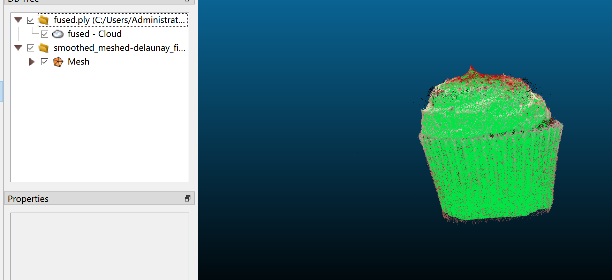
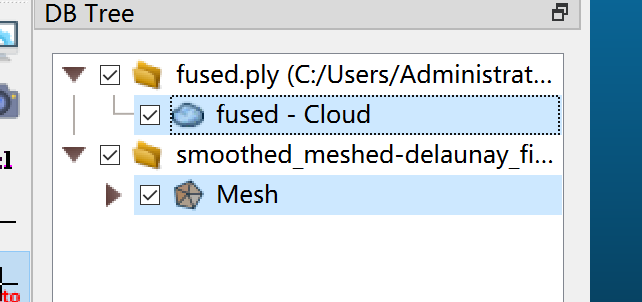

This repository contains the code implementation of the technical report for the Physically Informed 3D Food Reconstruction Challenge at CVPR 2024 MetaFood Workshop.


The structure of repository:
```
.
├── colmap_process
│   ├── colmap_dense_for_all.sh                     # 生成稠密点云
│   ├── colmap_masked_dense_for_all.sh              # 依据掩码信息生成物体级别的稠密点云
│   ├── filter_mesh_based_mask.sh                   # 依据掩码信息对mesh进行投影过滤
│   ├── gen_colmap_for_all.sh                       # 生成1~15物体的colmap信息
│   ├── gen_delaunayMesh.sh                         # 依据delaunayMesh模型从点云生成mesh
│   └── src
│       ├── add_mask_and_depth.py
│       ├── colmap2nerf.py
│       ├── colmap_depth_process.py
│       ├── filter_mesh_based_on_mask.py
│       ├── filter_pose_from_images_txt.py
│       ├── food_colmap_images.py
│       ├── mask_original.py
│       └── transform_colmap_camera.py
├── diffusionerf
├── nerf2mesh
├── ZeroNVS
├── mesh_refined
│   ├── fix_all_mesh.sh                             # 消除mesh空洞
│   ├── quick_fix_smooth_cal.sh                     # 对单个物体直接全部的refine操作并计算体积
│   ├── smooth_all_mesh.sh                          # 平滑mesh表面
│   └── src
│       ├── mesh_fixer.py
│       ├── quick_apply_scale.py
│       ├── quick_get_volumn.py
│       └── smooth_mesh.py
├── scale_estimate
│   ├── find_scale.py                               # 得到单个物体的scale估计结果。
│   └── scale_results.txt                           # 1~15全部scale估计结果
│── alignment
│   ├── align_gradient_descent.py                   # 使用梯度下降方法对齐。
│   └── icp_based_transforms.py                     # 使用手动粗对齐+icp精对齐的方法
└── requirements.txt
```

## Get Started

### Installation
```
pip install -r requirements.txt
```

## Usage
### datasets preprocess
1. Generate corresponding image poses for objects 1 to 15, and create a transforms.json file for training with NeRF-Based methods.
```
bash .\colmap_process\gen_colmap_for_all.sh
```
2. Generate dense point clouds of the objects for scale estimation.
```
bash .\colmap_process\colmap_dense_for_all.sh
```

### scale estimation
```
python .\scale_estimate\find_scale.py
```
Below is the explanation of the parameters in the file.
- `data_root`: The root directory where the input data is stored.
- `save_root`: The directory where the output data will be saved. 
- `data_name`: The name or identifier for the specific dataset being used. 
- `colmap_pth`: The subdirectory under the data root where COLMAP sparse reconstruction results are stored. 
- `ply_name`: The name of the PLY file that contains the fused point cloud data.
- `chess_h`: The height (number of rows) of the chessboard used for calibration. Here, it's 3.
- `chess_w`: The width (number of columns) of the chessboard used for calibration. Here, it's 4.
- `chess_T`: The size of each square on the chessboard in millimeters.
- `downsample`: The downsample rate for the point cloud. 
- `std_size`: The standard size for the chessboard size.
The scale we obtained is saved in the `.\scale_estimate\scale_results.txt` directory.

### 3d reconstruction
For objects 1 to 15, we first use the colmap dense model as a baseline. For each object's dense point cloud information obtained during the datasets preprocess stage, we first obtain each object's mesh file using the delaunayMesh method.
```
bash .\colmap_process\gen_delaunayMesh.sh
```
Then, based on the provided mask information, we implement mesh filtering to obtain the final object-level mesh.
```
bash .\colmap_process\colmap_masked_dense_for_all.sh
```
If you want to use DiffusionNeRF or NeRF2Mesh for multi-view 3D reconstruction, please refer to their respective instructions.

And if you want to perform single-view 3D reconstruction, please refer to the instructions for ZeroNVS.

### mesh refinement
The mesh refinement operation aims to eliminate holes and noise on the surface of the object. It is mainly implemented through the following two scripts.
```
bash .\mesh_refined\fix_all_mesh.sh     # Fill  holes
bash .\mesh_refined\smooth_all_mesh.sh  # Smooth the mesh
```

### model alignment
The model alignment section is mainly used to align with the ground truth Mesh. We first perform the alignment using manual coarse alignment followed by ICP fine alignment. We provide a visual method for alignment.
```
python .\alignment\icp_based_transforms.py
```
You may choose to further optimize using the gradient descent method
```
python .\alignment\align_gradient_descent.py
```

### Color the Mesh

To merge a colorless mesh with a colored point cloud, we need to download the tool [CloudCompare](https://www.danielgm.net/cc/).

You need following 3D objects:

Colorless mesh: `smoothed_meshed-delaunay_fixed.ply` (Assume that you have completed the refine process and generated this file.)

Colored point cloud: `fused.ply`

Then:

* Open CloudCompare software
* File - Open - Select `fused.ply` - Apply
* File - Open - Select `smoothed_meshed-delaunay_fixed.ply` - Apply

Then you should have the following interface:



Then:

* Hold down the Ctrl key, then select both Mesh and Cloud simultaneously.



Then:

* Edit - Colors - Interpolate from another entity

After interpolating, the mesh should have color.

Then you can delete the cloud, export as you want.

Full demo:

